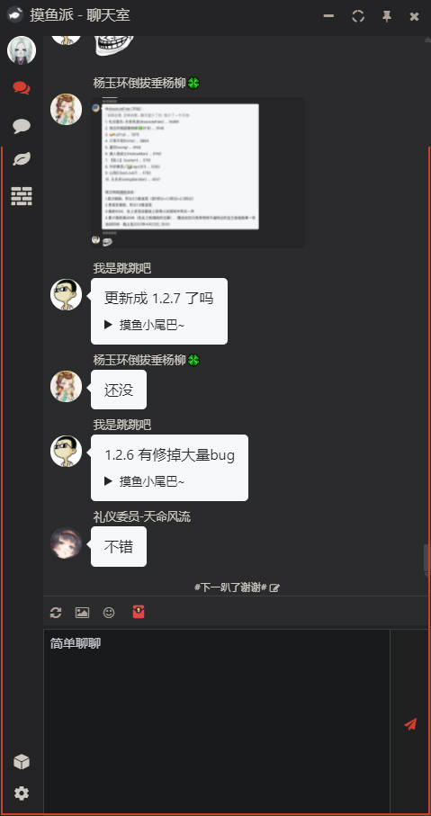

# 摸鱼派客户端 隐藏用户列表主题

支援 1.2.2 版本以上[摸鱼派客户端](https://github.com/imlinhanchao/fishpi-desktop)。

## 安装

查看客户端设置界面的**扩展目录**，在该目录下执行: 
```bash
git clone https://github.com/csfwff/fishpi-theme-hide-user-list.git
```
或下载 Code 压缩档，解压到该目录。

重新进入设置界面，主题栏位下拉选择`全局隐藏用户列表`即可。

## 预览

